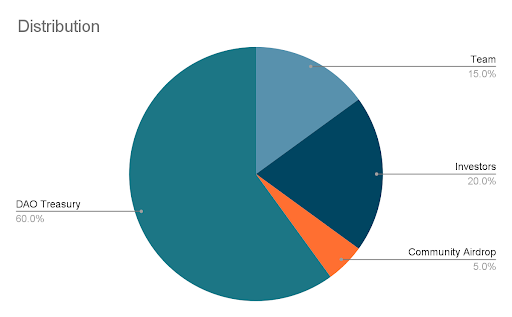
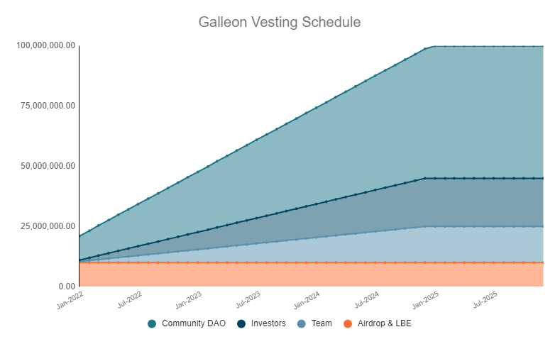

# 🪙 Tokenomics

### **Utility**

* Funding DAO contributors. We aim to stay nimble with contributor count, acting heavily in favour of full-time core contributors in contrast to large working groups of part-time members. We will leverage wider community contributors through paid bounties and grants with clear outcomes.&#x20;
* Revenue from structured products will initially be accrued back to the DAO treasury under governance control, later down the line we are very interested in exploring fee-sharing utility for DOUBLOON holders, but only after achieving significant growth where the revenue makes sense.&#x20;
* Product incentivisation schemes, grants & bounties. Incentivisation will be focused on long-tail sticky growth (minting Sets, development bounties, partnerships, bootstrapping product liquidity)&#x20;
* DOUBLOON holders have the ability to shape how the DAO treasury funds are spent by influencing snapshot votes proposed by the core team.

DOUBLOON will launch as a simple ERC-20 governance token initially, but Galleon is keen to further experiment with token utility as the project progresses.&#x20;

* Buyback mechanism with fee revenue to then re-inject back into incentivisation.
* Dual token + NFT governance mechanisms.

### Distribution

Max Supply: 100M&#x20;

Deployment Network: Arbitrum&#x20;

Fully Diluted Market Cap: $5M

Circulating Market Cap: $1M

#### **High-level DOUBLOON distribution:**

* 65% Community owned DAO treasury
* 20% Investors
* 15% Galleon Core Team

#### **Of the initial circulating supply:**

* 10% Community owned DAO treasury
* 5% Treasury Bootstrapping Event
* 5% Airdrop to incentivise community engagement

#### Token Valuation

**Seed:** $0.05

**LBE:** [Copper Launch on Arbitrum](https://arbitrum.copperlaunch.com/pools/0x2dB615Fe592EC8B147a40df788C829D08Fbb6F65)

#### $DBL 3 Year Linear Distribution Plan

<table><thead><tr><th>Participant</th><th data-type="number">Y0</th><th data-type="number">Y1</th><th data-type="number">Y2</th><th data-type="number">Y3</th><th data-type="number">Total</th></tr></thead><tbody><tr><td><strong>DAO Treasury</strong></td><td>10000000</td><td>15000000</td><td>15000000</td><td>15000000</td><td>55000000</td></tr><tr><td><strong>DAO Airdrop &#x26; LBE</strong></td><td>10000000</td><td>0</td><td>0</td><td>0</td><td>10000000</td></tr><tr><td><strong>Team</strong></td><td>null</td><td>5000000</td><td>5000000</td><td>5000000</td><td>15000000</td></tr><tr><td><strong>Investors</strong></td><td>null</td><td>6666667</td><td>6666667</td><td>6666667</td><td>20000000</td></tr></tbody></table>

